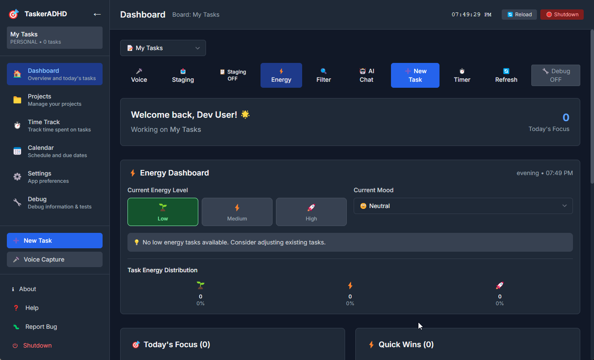

# 🎯 TaskerADHD

**ADHD-friendly task management with time tracking, energy awareness, and focus tools.**



<a href="https://www.buymeacoffee.com/curiocrafter" target="_blank">
  
</a>

TaskerADHD is designed specifically for people with ADHD, incorporating research-based strategies to help manage time blindness, hyperfocus, and executive function challenges.

## 🔑 Required API Keys

**⚠️ IMPORTANT: You need the following API keys to use all features:**

- **OpenAI API Key** - For AI-powered task creation and voice processing
- **Deepgram API Key** - For speech-to-text voice capture functionality

> **Note:** The app will work without these keys, but voice features and AI assistance will be disabled.

## 💾 Data Storage & Privacy

**Your data stays local and private:**

- **Tasks & Projects** - Stored in local SQLite database (server folder)
- **Time Tracking** - Stored locally in your browser/desktop app
- **Calendar Events** - Stored locally in your browser/desktop app
- **Settings & Preferences** - Stored locally on your device
- **Voice Recordings** - Processed in real-time, never stored permanently

**No cloud sync by default** - all data remains on your device. You can export/import data as JSON files for backup or transfer between devices.

## ✨ Key Features

### 🧠 ADHD-Focused Design
- **Time Tracking** with reality-check estimates vs actual time
- **Energy Level Management** to match tasks with your current state  
- **Dockable Timer Widget** that stays visible while you work
- **Focus Mode** with minimal distractions
- **Gentle Notifications** that don't break hyperfocus

### 📊 Time Tracking & Analytics
- **One-Click Timer** start from any task
- **Desktop Widget** dockable like Windows 11 taskbar widgets
- **Session Analytics** to understand your work patterns
- **Energy Correlation** tracking for optimal scheduling
- **Export Capabilities** for professional time reporting

### 🎨 Modern UI/UX
- **Clean Interface** designed to reduce overwhelm
- **Dark/Light/Low-Stim** themes for sensory needs
- **Mobile Responsive** works on all devices
- **Accessibility First** with screen reader support

### 🔧 Technical Features
- **Electron Desktop App** with native OS integration
- **PWA Support** for web installation
- **Offline Capable** with local data storage
- **Debug System** with global toggle for development

## 🚀 Getting Started

### Prerequisites
- Node.js 18+ 
- npm or yarn package manager

### 📦 Building Distributables

**Windows users can build:**
- ✅ Windows (.exe installer)
- ❌ Linux packages (not supported from Windows)
- ❌ macOS packages (not supported from Windows)

**macOS users can build:**
- ✅ macOS (.app, .dmg installer)
- ✅ Windows (.exe installer)  
- ✅ Linux (.AppImage, .deb packages)

**Linux users can build:**
- ✅ Linux (.AppImage, .deb packages)
- ✅ Windows (.exe installer)
- ❌ macOS packages (not supported from Linux)

> **Note:** Cross-platform builds have limitations:
> - **macOS builds** require a macOS system due to Apple's code signing requirements
> - **Linux builds** cannot be created from Windows systems
> - **Windows builds** can be created from any platform
> - If you need packages for other platforms, you'll need to build from that platform or use the source repository directly.

### Installation

1. **Clone the repository**
   ```bash
   git clone https://github.com/CurioCrafter/TaskerADHD.git
   cd TaskerADHD
   ```

2. **Install dependencies**
   ```bash
   npm install
   cd client && npm install
   cd ../server && npm install
   ```

3. **Setup environment**
   ```bash
   cp env.example .env
   # Edit .env with your configuration
   ```

4. **Initialize database**
   ```bash
   cd server
   npx prisma generate
   npx prisma db push
   ```

5. **Start development servers**
   ```bash
   # Terminal 1: Start server
   cd server && npm run dev
   
   # Terminal 2: Start client  
   cd client && npm run dev
   
   # Terminal 3: Start Electron (optional)
   npm run electron:dev
   ```

### 🧪 Demo Tasks for Learning

When you first launch the app, **demo tasks are automatically created** to help you understand how different features work:

- **Repeatable Tasks**: Daily standups, weekly reviews, monthly budgets
- **Priority Examples**: Urgent, high, medium, and low priority tasks  
- **Energy Level Matching**: Tasks designed for different energy states
- **Time Estimates & Labels**: Examples of task metadata

These demo tasks appear in your **calendar**, **projects**, and **boards** to demonstrate the app's capabilities.

**Demo Task Management** (Settings → Demo Tasks):
- **🗑️ Remove All Demo Tasks**: Permanently delete all demo tasks from your workspace
- **🔄 Reset Demo Tasks Flag**: Allow demo tasks to be recreated when you visit the calendar
- **➕ Add Demo Tasks**: Manually add demo tasks to your first board

**Note**: Demo tasks are only created once per app installation. Once removed, they won't automatically reappear unless you manually reset the flag or add them back.

### 🏗️ Building for Distribution

**Build for your current platform:**
```bash
npm run dist
```

**Build for specific platforms:**
```bash
npm run dist:win    # Windows only
npm run dist:mac    # macOS only (requires macOS)
npm run dist:linux  # Linux only
```

**Cross-platform builds:**
- **Windows users**: Can only build Windows packages
- **macOS users**: Can build all platforms (Windows, macOS, Linux)
- **Linux users**: Can build Linux + Windows packages

### 🎨 Custom App Icons

**Current Status**: The app uses the default Electron icon for builds. To use custom icons:

**For Windows builds**: Create `assets/icon.ico` (256x256 or larger)
**For macOS builds**: Create `assets/icon.icns` (512x512 or larger)  
**For Linux builds**: Create `assets/icon.png` (512x512 or larger)

**Icon Conversion Tools**:
- **Online**: Convert your `client/public/icon.svg` to the required formats
- **Command Line**: Use tools like `imagemagick` or `ffmpeg`
- **Desktop Apps**: GIMP, Photoshop, or Sketch

**Note**: The SVG icon in `client/public/icon.svg` is used for the web app and can be converted to the required desktop formats.

## 📖 Usage Guide

### Time Tracking Workflow
1. **Navigate to Time Track** page from the sidebar
2. **Select a task** from your project boards
3. **Click Start** to begin timing
4. **Use the Timer Widget** (click "⏱️ Timer" on dashboard) for always-visible tracking
5. **Stop timer** when done - automatic logging with analytics
6. **Export / Import**
   - Export: Time Track → "⬇️ Export Time Data" (JSON)
   - Import: Time Track → "⬆️ Import Time Data" (select a previously exported JSON)
   - Data stays local; no server required

### Voice + Calendar (Local-first)
- Use the Voice Capture modal and say natural phrases like:
  - "Plan weekly Chick-fil-A visits every Friday at 6pm for 10 weeks"
  - "Grocery shopping every weekend at 10am"
  - **"I want chicken tacos for every week"** → Automatically creates repeatable task for next Monday at 9am
  - **"Every weekend"** → Automatically creates repeatable task for next Saturday at 10am
- The Voice Calendar modal proposes tasks and calendar events:
  - Toggle "Use Staging for tasks" to route tasks via staging or directly into the board
  - Accept to save events locally (appear as purple entries in Calendar)
- **Smart Defaults**: The AI automatically sets reasonable due dates and repeat patterns for common phrases
- Only asks for clarification when truly ambiguous (e.g., "sometime this week" without specific details)

### Calendar
- Displays both:
  - Server-backed tasks with `dueAt`
  - Local voice-created events (purple chips)
- **Demo Tasks**: Automatically created examples showing repeatable patterns, priorities, and energy levels
- **Quick Task Creation**: Click the `+` button on any calendar day to add tasks for that specific date
- **Recurring Task Support**: Visual indicators for repeatable tasks with automatic instance generation
- Updates instantly when events are accepted from the voice modal

## 🗄️ Data Export / Import

Where your data lives:
- Tasks/Boards: server (SQLite/Prisma by default)
- Time tracking: local (Zustand + localStorage)
- Voice-created calendar events: localStorage

Export (local data):
- Settings → "⬇️ Export Local Data" to export settings, time tracking, and calendar events
- Time Track → "⬇️ Export Time Data" to export only time entries/logs

Import (local data):
- Settings → "⬆️ Import Local Data" and choose a JSON previously exported
- Time Track → "⬆️ Import Time Data" merges non-duplicate entries and rebuilds analytics

Portability:
- Exports are plain JSON; you can back them up/sync manually
- No cloud service required

### Desktop Widget
- **Toggle Widget**: Click "⏱️ Timer" button on dashboard
- **Drag to Position**: Click and drag the widget header to dock anywhere
- **Minimize**: Click "_" to minimize while keeping timer visible
- **Always on Top**: Widget stays visible across applications

### Energy Management  
- **Set Energy Levels** when creating tasks (HIGH/MEDIUM/LOW)
- **Filter by Energy** using the 🔍 Filter button
- **Match Tasks** to your current energy state for better productivity

### Focus Features
- **Hyperfocus Protection**: Timer alerts when working too long (optional)
- **Break Reminders**: Gentle notifications for sustainable work sessions
- **Distraction-Free**: Clean UI that doesn't overwhelm

## 🏗️ Architecture

```
TaskerADHD/
├── client/          # Next.js frontend (React/TypeScript)
├── server/          # Express.js backend (Node.js/TypeScript) 
├── electron/        # Electron main process
├── docs/           # Documentation
└── dist-new/       # Built application
```

### Tech Stack
- **Frontend**: Next.js 14, React 18, TypeScript, Tailwind CSS
- **Backend**: Express.js, Prisma ORM, SQLite/PostgreSQL
- **Desktop**: Electron, cross-platform native integration
- **State**: Zustand for client state management
- **Styling**: Tailwind CSS with ADHD-friendly design system

## 🎨 Customization

### Themes
- **Light**: Standard bright theme
- **Dark**: Easy on the eyes for low-light work  
- **Low-Stim**: Minimal colors and distractions for sensory sensitivity

### Energy Levels
Tasks can be categorized by energy requirement:
- **HIGH**: Creative work, complex problem solving
- **MEDIUM**: Standard tasks, meetings, email
- **LOW**: Administrative work, organizing, simple tasks

### Debug Mode
Toggle debug mode from the dashboard for:
- Detailed console logs
- Performance monitoring  
- Development tools access

## 🔒 Privacy & Security

- **Local-First**: All data stored locally by default
- **No Analytics**: No tracking or data collection
- **API Keys Protected**: Enhanced .gitignore for sensitive data
- **Optional Cloud**: Sync only if you choose to configure it

## 🤝 Contributing

We welcome contributions! Please see [CONTRIBUTING.md](docs/CONTRIBUTING.md) for guidelines.

### Development Setup
1. Follow installation steps above
2. Enable debug mode for development tools
3. Use conventional commits for pull requests
4. Test across desktop and web platforms

## 📄 License

This project is licensed under the MIT License - see the [LICENSE](LICENSE) file for details.

## 🙏 Acknowledgments

- ADHD community for feedback and feature requests
- Research on time blindness and executive function
- Open source libraries that make this possible

## 🆘 Support

- **Documentation**: Check the [docs/](docs/) folder
- **Issues**: Report bugs on [GitHub Issues](https://github.com/CurioCrafter/TaskerADHD/issues)
- **Discussions**: Feature requests and questions welcome

---

**Built with ❤️ for the ADHD community**